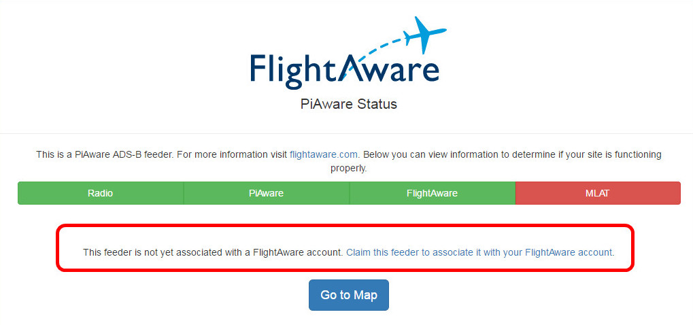

# FlightAware's PiAware Flight Tracker

For those that have never flown into San Diego's airport, the first time coming in can be a bit of an experience. San Diego's airport sits very close to downtown, right on the bay, and is at the bottom of a U-shaped landscape. I've heard it called a "teacup" landing due to the landscape around it but I'm not sure of the veracity of that. On normal approach the planes fly directly over Balboa Park, skim the rooftops of Bankers Hill, and just about take the top off one of the airport parking garages before landing on the one runway. The planes are all readily visible from our location here at GeekDojo. As you can imagine, this got us thinking, "It would be cool if we could track those planes, see who is coming and going, and maybe put it up on a screen somewhere?"

After a little research (honestly one Google search) we ran across [FlightAware's PiAware](https://flightaware.com/adsb/piaware/build/) and didn't need to look any further - such an easy package to put together! FlightAware provides some Raspberry Pi based hardware that allows us to tap into the [Automatic Dependent Surveillance-Broadcast (ADS-B) system](https://www.faa.gov/air_traffic/technology/adsb/). This system is required on every plane in the United States and most areas in the world. ADS-B is a satellite based technology that is replacing older radar based technologies for locating planes, airport vehicles, weather, and other hazards. For our use case we can eavesdrop on the technology to locate planes as they fly overhead broadcasting their identifiers, vectors, and altitudes. FlightAware crunches the data for us and displays it on a map with pertinent information.

Becoming a FlightAware ADS-B ground station has a couple other benefits beyond seeing all the overhead planes in a particular moment. For starters, you get an automatic free [Enterprise Account](https://flightaware.com/commercial/premium/) ($89.95 value) which provides detailed flight tracking, saved flights, and map and weather feeds. For frequent fliers this information can help provide detailed information on connection risks for any given day. If you or a family member owns a plane you can track that plane anywhere in the world.

## 1090Mhz Versus 978Mhz

ADS-B comes in two flavors, 1090Mhz and 978Mhz. 1090Mhz works anywhere in the world while 978Mhz is specific to the United States. 978Mhz usage is also limited to below 18,000' altitude. Which you choose really depends on the flights around you. In our case we choose 1090Mhz since San Diego is a decent size international airport. However, if you're nearest airport is a light-plane rural strip in the middle of Kansas you may want to go with 978Mhz since there's a good chance a number of the planes will run that frequency. Of course, nothing prevents you from running both frequencies if you prefer.

## Physical Setup

[FlightAware's store](https://flightaware.store/collections/all) offers complete kits or individual parts for both the 1090Mhz and 978Mhz. Total cost ranges from ~$90 to ~$150 depending on your choices. The complete kits come with PiZeros and indoor antennas. If you have a spare Pi 3, 4, or Zero W then you can simply purchase the USB stick and antenna. The physical setup of the indoor version took all of about 15 minutes. You'll get the best reception, up to 250 miles, with the outdoor antenna mounted on a pole or some other unobstructed space. In our case, we went with the 1090Mhz outdoor antenna and FlightAware Pro Plus receiver. The [instructions](https://flightaware.com/adsb/piaware/build/) are clear and concise and, honestly, it really boils down to flashing the SD Card with the [PiAware image](https://piaware.flightcdn.com/piaware-sd-card-7.2.img.zip), inserting the SD Card and USB receiver, connecting up all the cables, and starting the PI up. A note here, the standard Raspbian based image worked fine with a screen connected to the HDMI interface.

## Connecting to FlightAware

Once the PiAware is up and running you'll see some information come across the screen including the IP of the appliance. Browsing to that IP from your workstation or phone (assuming the phone is on the same network) will show the FlightAware screen and allow you to connect the device to your FlightAware account. One note here, if the "FlightAware" box is red and the console says it cannot connect you may need to open TCP 1200 to FlightAware's servers. If you're not automatically locking down outbound traffic from your network we highly recommend you do so. Likewise, if the "Radio" box is Orange then the antenna needs to be moved to a place with better reception.

## Watching the Local Airspace

Once you've claimed the new feeder you can click the "Go to Map" button on the bottom of the same page and you should start seeing the flights populate. There is a gear at the top to customize the map and feeds. For our part we turned off flight trails and enabled labels. Doing so cleaned up the map a bit with all the traffic flying in and around San Diego airport. That's personal preference of course so do whatever makes sense for your use case. You'll be able to see statistics on your account with regard to planes tracked and data points accumulated along with other contributors around the world.

Stick that up on a spare monitor somewhere for house guests to peruse. It's fully web-based so works from any device on the same network (mobile or desktop). Have fun and enjoy watching the flights entering and leaving your airspace.
