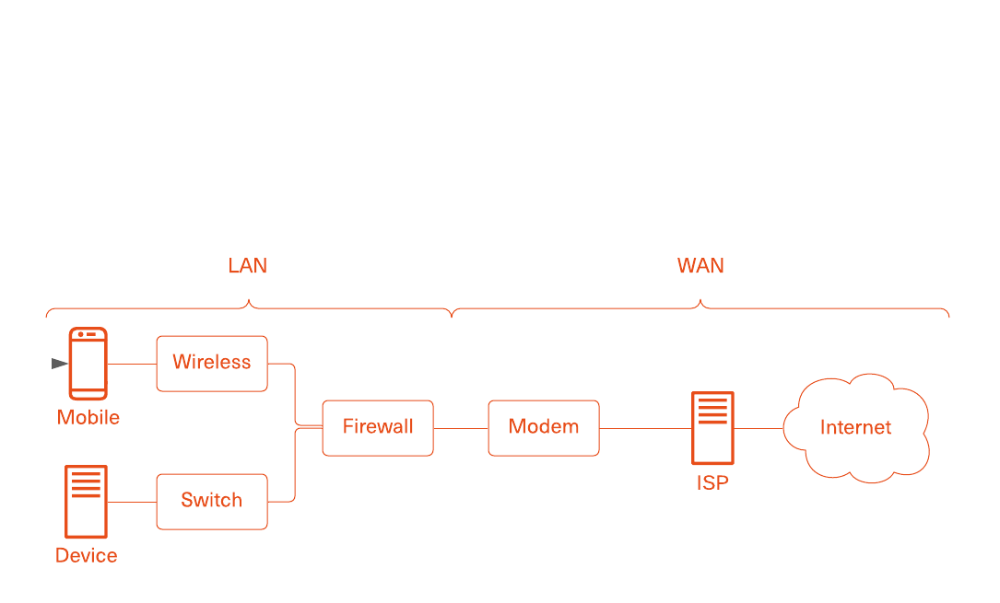

# Common Home Network Devices

Within any home there are a number of network devices in common use. It is also quite common for functions to be combined into a single device. For instance, the device from your cable provider may combine a modem, firewall, router, wifi, and switch into a single device. In either scenario the flow of data follows a path similar to the diagram below:

This is a good time explain the concepts of a Local Area Network (LAN) and a Wide Area Network (WAN). The LAN is generally considered to be any portion of the network residing in a specific location and *typically* is located behind a firewall. It is often also considered the *private* network. The WAN is generally the opposite. It is the portion of the network that encompasses a large geographic area. This portion of the network often includes either the public internet or dedicated traffic lanes between locations (such as fiber optic lines). A WAN can be completely private but for home networking purposes is generally considered the public internet.

## Hardware Devices

As mentioned earlier, there are a number of devices that work together to allow data to flow between your home devices and servers on the internet.

### Modem

A modem is a device that converts signals of one type to signals of another type. In the 1990s this was typically converting signals sent over a phone line to signals that TCP/IP based equipment could understand. As broadband became common in the early 2000s the modem evolved to convert signals sent over cable systems. The Starlink modems convert signals received from the Starlink satellite system.

### Router

The router is a TCP/IP based device that routes traffic from one network to another network. It does this by advertising the address space it owns to other routers that it is immediately connected to. Likewise, the router may convert addresses on its own network to addresses on a different network. This process is what a home network router uses to hide the private home devices behind a single public IP (known as port address translation or PAT).

### Firewall

The firewall is a software based application that accepts or blocks traffic from specific IPs or ports. More sophisticated firewalls will also block traffic based on the type of traffic. For example, the firewall may allow only HTTP traffic on port 80 or DNS traffic on port 53. This is to prevent malicious actors from sending inappropriate data across open ports. The firewall is arguably the most critical networking component in any home. A firewall is usually part of home routers but may also be purchased as a stand-alone device. Windows and Macs come with a firewall preinstalled that works to allow expected application traffic through to the internet.

### Switch

The switch is responsible for connecting multiple devices together and to the rest of the network. Switches come in many sizes and with many variations in features. In the simplest form they do not expose any management interface and ethernet cables are plugged in and connectivity is established. The more complex models offer everything from LAN separation (called VLANs) to Quality of Service (QoS) functions that allow you to limit the bandwidth consumed by the guest network or the kids.

### Wireless Switch

The wireless switch works in the same manner as a normal wired switch but does so using radio wave based protocols. 

### Network Interface Card (Nic)

The network interface card is a device installed within the computer to allow connectivity to the network. This device is commonly built into most computers today. Depending on the device it may accept ethernet cables, fiber optic, or be a wifi based device.

### Lan Cables

While this one seems obvious it is worth noting since many homes no longer use wired ethernet cables. These cables have eight (8) internal wires and form a physical connection between two network devices. Wired connections are generally considered to provide substantially more bandwidth than wireless connections however depending on usage within a home that may be irrelevant.

### Power over Ethernet (PoE)

While typically not a separate device, PoE is worth noting because it can make setting up wireless access points in hard to reach areas much simpler. PoE sends power (up to 15.4 watts at 48vDC) over the ethernet cable along with the ethernet signal. This means pulling a single cable to the access point's location with no power requirements.

### The Host

A computer or other device on the network is typically considered the *Host*. It will send, receive, and process data. It could be a desktop, laptop, mobile device, RaspberryPi, or anything else on the network. In a typical network transaction the host may be called a *client* if it is receiving information from a company's *server*. The web browser on the desktop is always considered a *client*.
