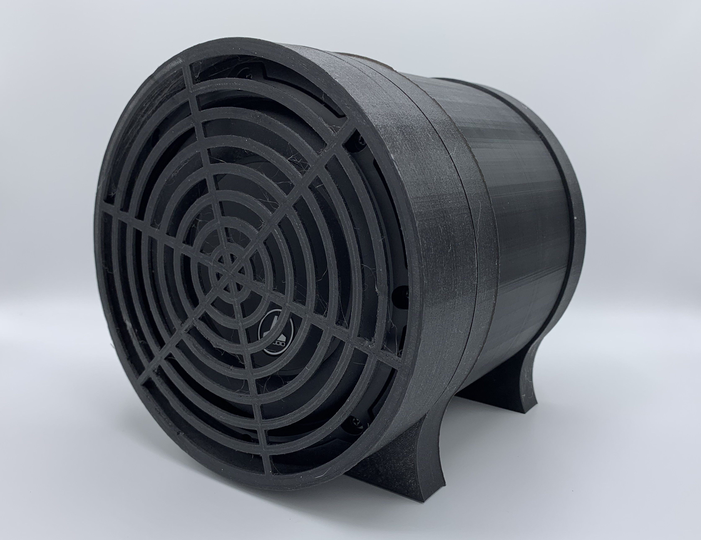
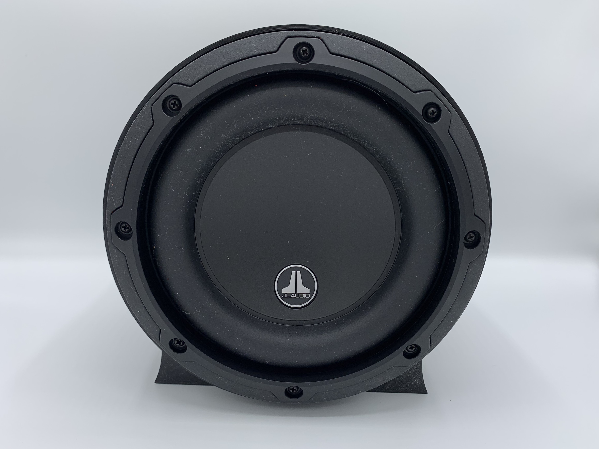
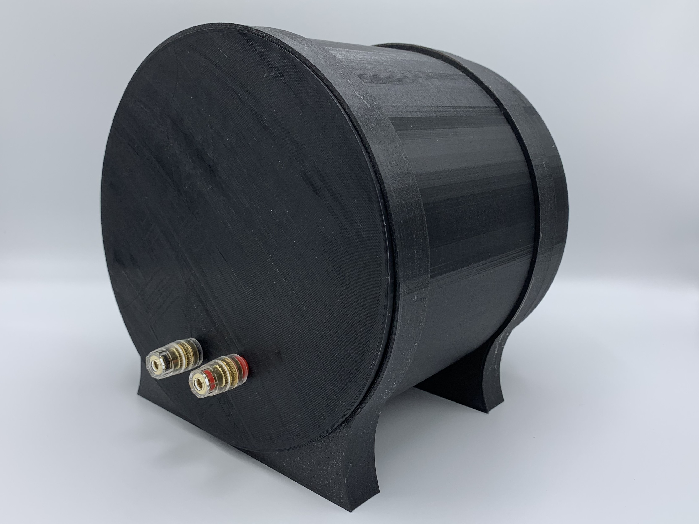

# JL Audio 6w3v3-4 (or -8) Bass Tube

This repository contains STL files for 3d-printing a 6.5" bass tube tuned to 35Hz. The tube is a sealed design providing quick response time with enough low end to keep up with home theater or video game demands. Gun fire provides plenty of punch and explosions roll off the tube shaking your seat.

Image 1                                          |  Image 2                                          |   Image 3
:-----------------------------------------------:|:-------------------------------------------------:|:-------------------------:
  |    |  

## Files

- [BassTube.stl](media/designs/BassTube.stl): The bass tube itself
- [Grill.stl](media/designs/Grill.stl): The Grill for the front of the tube. Entirely optional depending on preference and need. If the tube is somewhere the vacuum cleaner can whack it I highly recommend the grill.
- [JLAudio_6w3v3_Tube_Sealed_v7.f3d](media/designs/JLAudio_6w3v3_Tube_Sealed_v7.f3d): The original AutoDesk Fusion design files in case you want to customize to your liking.
- [JLAudio_6w3v34.pdf](media/JLAudio_6w3v34.pdf): The manual that comes with the subwoofer.
- [Mount.stl](media/designs/Mount.stl): The floor mount for the tube - print two of them.

## Materials

- ~700g PLA Filament (bass tube)
- ~200g TPU 95A Filament (mounts and grill)
- 1 [JL Audio 6w3v3-4](https://www.crutchfield.com/p_1366W3V34/JL-Audio-6W3v3-4.html?awcp=1t1&awcr=189628602181&awdv=c&awkw=6w3v34&awmt=p&awnw=g&awug=9031329&gclid=EAIaIQobChMIhf7kgbDu4gIVlcJkCh1tGwu2EAAYASAAEgLclPD_BwE)
- 1 pair [Banana Plug Binding Post](https://www.amazon.com/gp/product/B076JBS2K2/ref=ppx_yo_dt_b_asin_title_o01_s00?ie=UTF8&psc=1)
- ~8" Speaker Wire
- Handfull of [Polyfill](https://www.amazon.com/Fairfield-PF16B-Poly-Fil-Premium-Polyester/dp/B006I04VLU/ref=sr_1_2?keywords=speaker+polyfill&qid=1560701273&s=gateway&sr=8-2)
- 8 [Ez Lok 260-004-BR Flanged Press Insert](https://www.amazon.com/gp/product/B06XGX13CQ/ref=ppx_yo_dt_b_asin_title_o00_s00?ie=UTF8&psc=1)
- 8 [#4-40 x 5/8" Black Oxide Pan head Machine Screws](https://www.boltdepot.com/Product-Details.aspx?product=21977)
- 8 [#4 Black Oxide Flat Washers](https://www.boltdepot.com/Product-Details.aspx?product=22036)

## 3D Printer Instructions

I printed the tube on an Ultimaker 2+ Extended. Given the large diameter very little room is left on the print bed and warping on the tube was a major problem. Because of that I spent a lot of time tweaking the print settings. The STLs do not contain these customizations since each printer is different. I've listed them below:

### Bass Tube (PLA)

- .4 mm Nozzle
- Fine 0.1mm
- 20% infill
- Quality: Initial Layer Height: .27mm
- Shell: Bottom Pattern Initial Layer: ZigZag
- Speed: Initial Layer Spedd: 15mm/s
- Cooling: Fan Speed: 60%
- Cooling: Initial Fan Speed: 35%
- Cooling: Initial Fan Speed: 0
- Build Plate Adhesion: Build Plate Adhesion Type: Brim

### Grill and Mounts (TPU 95A)

- .4 mm Nozzle
- Fine 0.1mm
- 10% infill
- Quality: Initial Layer Height: .27mm
- Shell: Bottom Pattern Initial Layer: Line
- Speed: Initial Layer Spedd: 15mm/s
- Cooling: Fan Speed: 60%
- Cooling: Initial Fan Speed: 35%
- Cooling: Initial Fan Speed: 0
- Build Plate Adhesion: Build Plate Adhesion Type: Brim

## Assembly Instructions

Everything should be pretty self explanatory (log an issue if you have a question) with the exception of the flanges. Once your print is complete you'll note some 4mm x 4mm holes on the woofer end of the tube. That's where the flanges go for the speaker mounting screws. Heat up a soldering iron to around 2/3's heat. When hot slide a flange on the end of the iron with knurls pointing away from the iron. Be careful the brass heats super quickly. You should be able to just rest the knurled end on top of the 4mm x 4mm hole and the weight of the iron should push it into the hole. Push it down until the flanged bit is flush with the surface. Be careful not to push so far that you start bowing the plastic. If done correctly you end up with 8 perfect mounting holes for the #4-40 machine screws. Image below shows what this should look like when complete:

## AutoDesk Extrude Heights

- **BassTube:**
- Floor height 		13mm
- inner height 		158mm
- inner screw height	154mm
- outer height 		164mm
- **Grill:**
- Vents			2mm
- Inner edge		20mm
- Outer edge		40mm
- **Mount:**
- Depth			20mm
